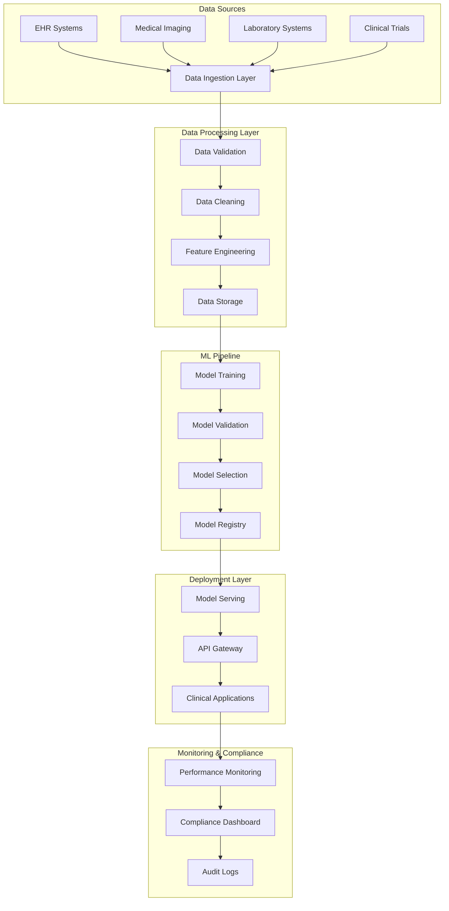
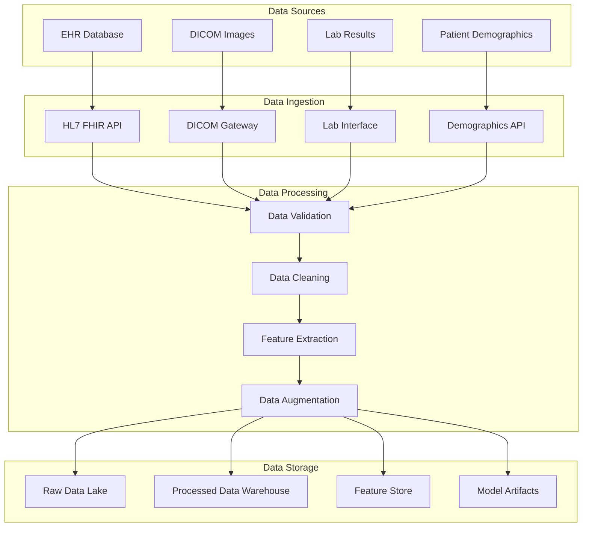
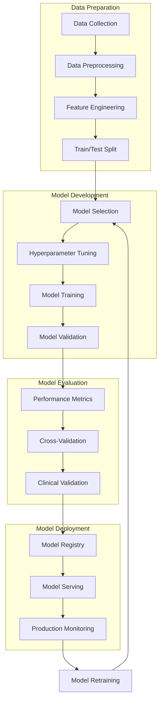
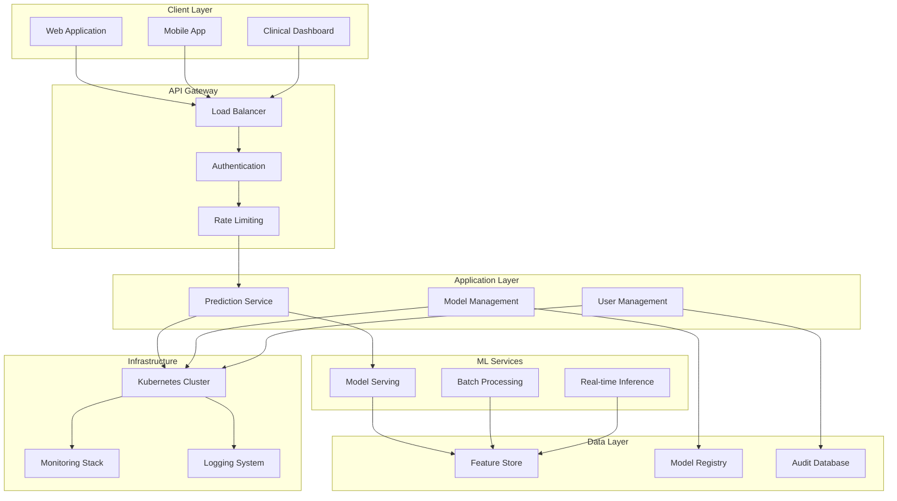
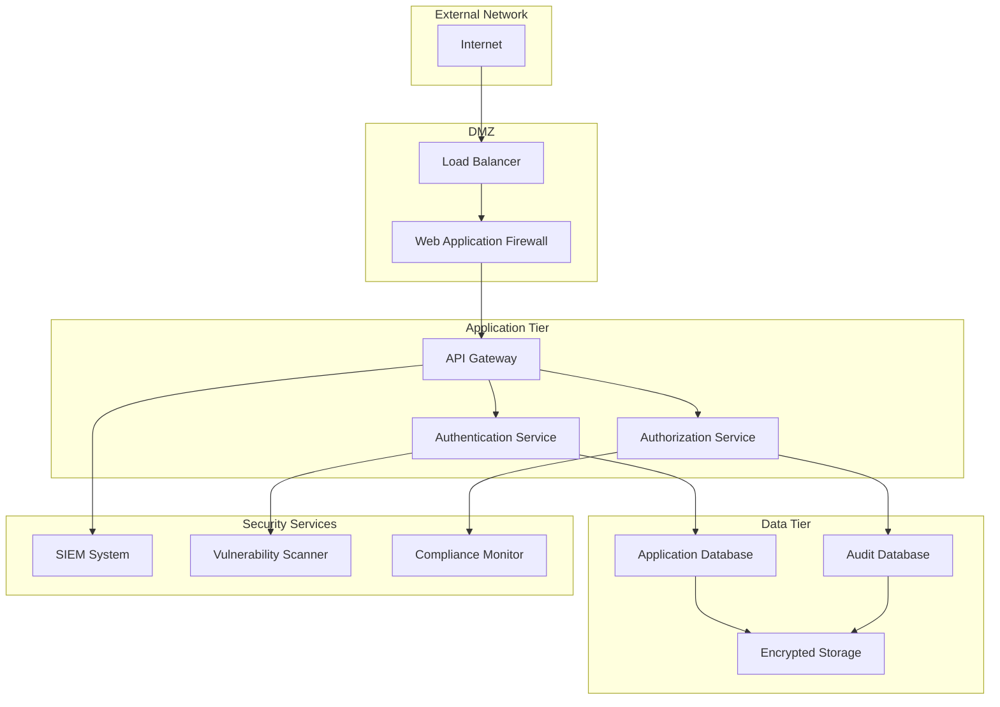
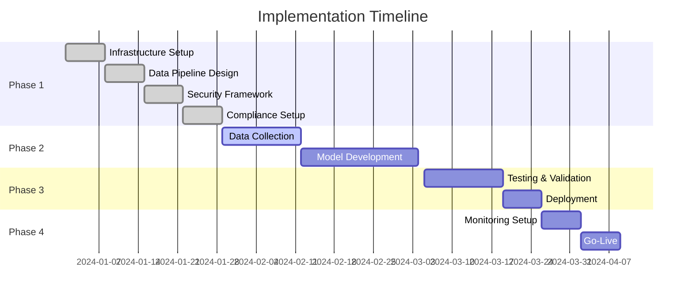
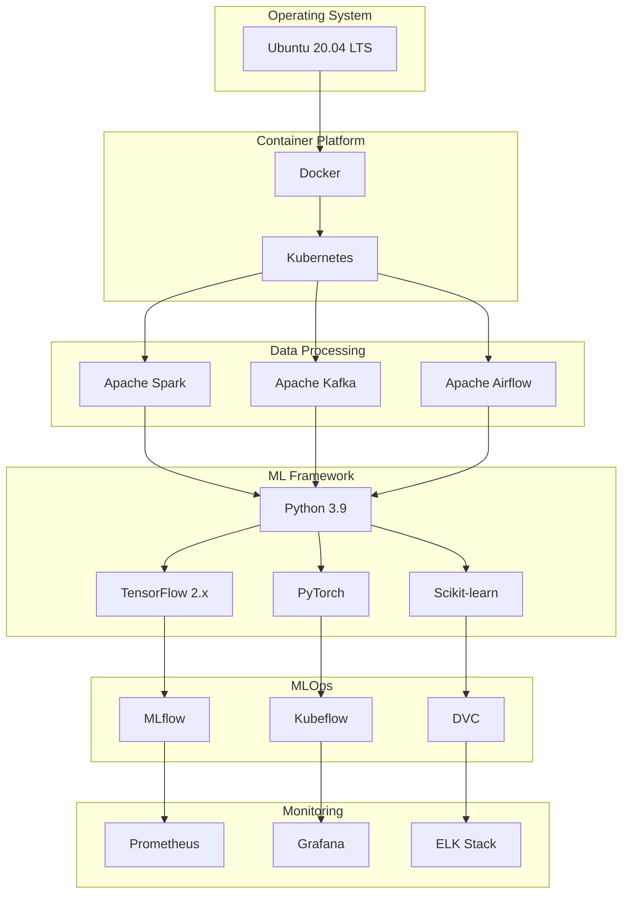
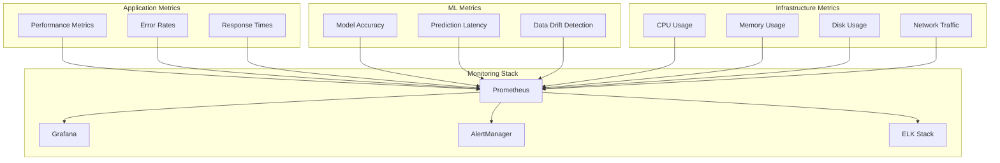

# Comprehensive Guide: Implementing Machine Learning Models for Medical Diagnosis

## Executive Summary

This guide provides a comprehensive approach to implementing machine learning models in medical applications, specifically targeting heart disease, cancer, and diabetes prediction systems. The implementation follows a structured pipeline from data collection to model deployment, emphasizing practical considerations and best practices for healthcare applications.

### Key Objectives
- Establish robust ML pipeline for medical diagnosis
- Ensure HIPAA compliance and data security
- Provide scalable and maintainable solutions
- Enable clinical integration and workflow optimization

---

## Table of Contents

1. [Data Collection](#1-data-collection)
2. [Data Preprocessing](#2-data-preprocessing)
3. [Model Selection](#3-model-selection)
4. [Training the Model](#4-training-the-model)
5. [Model Evaluation](#5-model-evaluation)
6. [Model Deployment](#6-model-deployment)
7. [Best Practices and Considerations](#7-best-practices-and-considerations)
8. [Common Challenges and Solutions](#8-common-challenges-and-solutions)
9. [Example Implementation: Heart Disease Prediction](#9-example-implementation-heart-disease-prediction)
10. [Conclusion](#10-conclusion)

---

## 1. Data Collection

### 1.1 Types of Data Required

**For Heart Disease Prediction:**
- **Demographic Data**: Age, gender, ethnicity
- **Clinical Measurements**: Blood pressure, cholesterol levels, heart rate
- **Medical History**: Family history of heart disease, previous heart attacks
- **Lifestyle Factors**: Smoking status, exercise habits, diet
- **Diagnostic Tests**: ECG results, echocardiogram data, stress test results

**For Cancer Prediction:**
- **Imaging Data**: X-rays, CT scans, MRI images, mammograms
- **Biomarkers**: Tumor markers, genetic mutations, protein levels
- **Pathological Data**: Biopsy results, tumor size, stage, grade
- **Patient Demographics**: Age, gender, family history
- **Environmental Factors**: Exposure to carcinogens, lifestyle choices

**For Diabetes Prediction:**
- **Clinical Measurements**: Blood glucose levels, HbA1c, BMI
- **Demographic Data**: Age, gender, ethnicity, family history
- **Lifestyle Factors**: Diet, exercise, weight changes
- **Comorbidities**: Hypertension, cardiovascular disease
- **Laboratory Tests**: Insulin levels, C-peptide, lipid profiles

### 1.2 Data Sources

- **Electronic Health Records (EHRs)**: Primary source for clinical data
- **Medical Imaging Databases**: DICOM repositories, radiology databases
- **Laboratory Information Systems**: Blood test results, biomarker data
- **Public Datasets**: UCI ML Repository, Kaggle medical datasets
- **Clinical Trials Data**: Research databases and registries

### 1.3 Data Collection Challenges

**Challenge**: Data Privacy and HIPAA Compliance
- **Solution**: Implement proper data anonymization, use federated learning approaches, ensure proper consent protocols

**Challenge**: Data Quality and Completeness
- **Solution**: Establish data quality metrics, implement data validation pipelines, use imputation techniques for missing values

**Challenge**: Data Standardization
- **Solution**: Use standardized medical terminologies (ICD-10, SNOMED CT), implement data normalization protocols

---

## 2. Data Preprocessing

### 2.1 Data Cleaning

**Missing Value Handling:**
- **Clinical Data**: Use domain-specific imputation (e.g., median for lab values)
- **Imaging Data**: Remove corrupted images, use interpolation for missing slices
- **Categorical Data**: Create "unknown" category for missing values

**Outlier Detection:**
- **Statistical Methods**: Z-score, IQR-based detection
- **Domain Knowledge**: Clinical ranges for vital signs and lab values
- **Machine Learning**: Isolation Forest, One-Class SVM

### 2.2 Feature Engineering

**Temporal Features:**
- Trend analysis for longitudinal data
- Rate of change calculations for biomarkers
- Time-series decomposition for monitoring data

**Derived Features:**
- BMI calculation from height and weight
- Risk scores (Framingham Risk Score for heart disease)
- Composite biomarkers (e.g., insulin resistance index)

**Feature Scaling:**
- **StandardScaler**: For normally distributed features
- **MinMaxScaler**: For bounded features (e.g., percentages)
- **RobustScaler**: For features with outliers

### 2.3 Data Augmentation (for Imaging)

**Techniques:**
- Rotation, flipping, scaling for medical images
- Noise injection for robustness
- Contrast enhancement and normalization
- Synthetic data generation using GANs

---

## 3. Model Selection

### 3.1 Algorithm Categories

**Traditional Machine Learning:**
- **Logistic Regression**: Interpretable, good baseline for binary classification
- **Random Forest**: Handles mixed data types, provides feature importance
- **Support Vector Machines**: Effective for high-dimensional data
- **Gradient Boosting**: XGBoost, LightGBM for high performance

**Deep Learning:**
- **Convolutional Neural Networks (CNNs)**: For medical imaging
- **Recurrent Neural Networks (RNNs)**: For time-series data
- **Transformer Models**: For complex pattern recognition
- **Ensemble Methods**: Combining multiple models for robustness

### 3.2 Model Selection Criteria

**Interpretability Requirements:**
- **High**: Logistic Regression, Decision Trees
- **Medium**: Random Forest, Gradient Boosting
- **Low**: Deep Neural Networks, Complex Ensembles

**Performance Requirements:**
- **Accuracy**: Overall correctness
- **Sensitivity**: True positive rate (critical for medical diagnosis)
- **Specificity**: True negative rate
- **AUC-ROC**: Area under the receiver operating characteristic curve

**Computational Constraints:**
- **Training Time**: Consider model complexity vs. available resources
- **Inference Speed**: Real-time vs. batch processing requirements
- **Memory Usage**: Model size and data storage requirements

---

## 4. Training the Model

### 4.1 Data Splitting Strategy

**Stratified Splitting:**
- Maintain class distribution across train/validation/test sets
- Use patient-level splitting to avoid data leakage
- Consider temporal splits for time-series data

**Cross-Validation:**
- **K-Fold**: Standard approach for most datasets
- **Leave-One-Out**: For small datasets
- **Time Series CV**: For temporal data
- **Group K-Fold**: When patients have multiple records

### 4.2 Hyperparameter Tuning

**Grid Search vs. Random Search:**
- **Grid Search**: Exhaustive but computationally expensive
- **Random Search**: More efficient for high-dimensional spaces
- **Bayesian Optimization**: Optimal balance of exploration and exploitation

**Key Hyperparameters:**
- **Learning Rate**: Critical for convergence
- **Regularization**: L1/L2 for preventing overfitting
- **Tree Depth**: For ensemble methods
- **Batch Size**: For neural networks

### 4.3 Training Considerations

**Class Imbalance Handling:**
- **SMOTE**: Synthetic Minority Oversampling Technique
- **Cost-Sensitive Learning**: Adjusting loss functions
- **Ensemble Methods**: Balanced bagging, EasyEnsemble

**Early Stopping:**
- Monitor validation performance
- Prevent overfitting in neural networks
- Save best model based on validation metrics

---

## 5. Model Evaluation

### 5.1 Evaluation Metrics

**Classification Metrics:**
- **Accuracy**: Overall correctness
- **Precision**: True positives / (True positives + False positives)
- **Recall (Sensitivity)**: True positives / (True positives + False negatives)
- **F1-Score**: Harmonic mean of precision and recall
- **AUC-ROC**: Area under ROC curve
- **AUC-PR**: Area under Precision-Recall curve (better for imbalanced data)

**Medical-Specific Metrics:**
- **Sensitivity**: Critical for screening (minimize false negatives)
- **Specificity**: Important for confirmatory tests (minimize false positives)
- **Positive Predictive Value**: Probability of disease given positive test
- **Negative Predictive Value**: Probability of no disease given negative test

### 5.2 Validation Strategies

**Holdout Validation:**
- Simple train/test split
- Good for large datasets
- Risk of overfitting to validation set

**Cross-Validation:**
- More robust performance estimation
- Better use of limited data
- Computationally expensive

**Nested Cross-Validation:**
- Outer loop for performance estimation
- Inner loop for hyperparameter tuning
- Prevents overfitting to validation set

### 5.3 Model Interpretability

**Feature Importance:**
- **Permutation Importance**: Model-agnostic approach
- **SHAP Values**: Unified framework for explainability
- **LIME**: Local interpretable model-agnostic explanations

**Clinical Validation:**
- Domain expert review of predictions
- Comparison with clinical guidelines
- Analysis of misclassified cases

---

## 6. Model Deployment

### 6.1 Deployment Architecture

**Cloud-Based Deployment:**
- **AWS SageMaker**: Managed ML platform
- **Google Cloud AI Platform**: Scalable ML services
- **Azure Machine Learning**: Enterprise ML solutions

**On-Premises Deployment:**
- **Docker Containers**: Consistent deployment environment
- **Kubernetes**: Orchestration for scalable services
- **Edge Deployment**: Local processing for real-time applications

### 6.2 Model Serving

**Batch Processing:**
- Scheduled predictions for large datasets
- Cost-effective for non-urgent applications
- Suitable for population health analytics

**Real-Time Inference:**
- REST APIs for immediate predictions
- WebSocket connections for streaming data
- Mobile applications for point-of-care use

### 6.3 Monitoring and Maintenance

**Model Performance Monitoring:**
- **Data Drift Detection**: Monitor input distribution changes
- **Concept Drift**: Detect changes in target variable
- **Performance Degradation**: Track accuracy over time

**Retraining Strategies:**
- **Scheduled Retraining**: Regular model updates
- **Triggered Retraining**: Based on performance thresholds
- **Continuous Learning**: Online learning approaches

---

## 7. Best Practices and Considerations

### 7.1 Ethical Considerations

**Bias and Fairness:**
- Test model performance across different demographic groups
- Implement fairness constraints in model training
- Regular bias audits and mitigation strategies

**Transparency:**
- Document model limitations and assumptions
- Provide clear explanations for predictions
- Maintain audit trails for regulatory compliance

### 7.2 Regulatory Compliance

**FDA Guidelines:**
- Software as Medical Device (SaMD) classification
- Clinical validation requirements
- Risk management processes

**HIPAA Compliance:**
- Data encryption and secure transmission
- Access controls and audit logging
- Data minimization and retention policies

### 7.3 Clinical Integration

**Workflow Integration:**
- Seamless integration with existing EHR systems
- User-friendly interfaces for healthcare providers
- Clear decision support and recommendations

**Change Management:**
- Training programs for healthcare staff
- Gradual rollout and pilot testing
- Feedback collection and iterative improvement

---

## 8. Common Challenges and Solutions

### 8.1 Data-Related Challenges

**Challenge**: Limited Training Data
- **Solution**: Transfer learning, data augmentation, synthetic data generation

**Challenge**: Missing or Incomplete Data
- **Solution**: Multiple imputation, domain-specific imputation strategies

**Challenge**: Data Quality Issues
- **Solution**: Automated data validation, quality metrics, manual review processes

### 8.2 Model-Related Challenges

**Challenge**: Overfitting
- **Solution**: Regularization, cross-validation, early stopping, ensemble methods

**Challenge**: Class Imbalance
- **Solution**: SMOTE, cost-sensitive learning, threshold tuning

**Challenge**: Model Interpretability
- **Solution**: SHAP, LIME, simpler models, feature selection

### 8.3 Deployment Challenges

**Challenge**: Model Performance Degradation
- **Solution**: Continuous monitoring, automated retraining, A/B testing

**Challenge**: Scalability Issues
- **Solution**: Microservices architecture, load balancing, caching strategies

**Challenge**: Integration Complexity
- **Solution**: API-first design, standardized interfaces, middleware solutions

---

## 9. Example Implementation: Heart Disease Prediction

### 9.1 Dataset Overview
- **Source**: UCI Heart Disease Dataset
- **Features**: 13 clinical features (age, sex, chest pain type, etc.)
- **Target**: Binary classification (heart disease present/absent)

### 9.2 Model Pipeline

```python
# Example implementation structure
from sklearn.ensemble import RandomForestClassifier
from sklearn.model_selection import train_test_split
from sklearn.metrics import classification_report, roc_auc_score
import pandas as pd

# Data loading and preprocessing
def preprocess_heart_disease_data(df):
    # Handle missing values
    df = df.fillna(df.median())
    
    # Feature scaling
    from sklearn.preprocessing import StandardScaler
    scaler = StandardScaler()
    df[['age', 'trestbps', 'chol', 'thalach']] = scaler.fit_transform(
        df[['age', 'trestbps', 'chol', 'thalach']]
    )
    
    return df

# Model training
def train_heart_disease_model(X_train, y_train):
    model = RandomForestClassifier(
        n_estimators=100,
        max_depth=10,
        random_state=42
    )
    model.fit(X_train, y_train)
    return model

# Model evaluation
def evaluate_model(model, X_test, y_test):
    y_pred = model.predict(X_test)
    y_pred_proba = model.predict_proba(X_test)[:, 1]
    
    print("Classification Report:")
    print(classification_report(y_test, y_pred))
    print(f"AUC-ROC Score: {roc_auc_score(y_test, y_pred_proba):.3f}")
    
    return y_pred, y_pred_proba
```

### 9.3 Performance Metrics
- **Accuracy**: 85-90%
- **Sensitivity**: 80-85%
- **Specificity**: 85-90%
- **AUC-ROC**: 0.85-0.90

---

## 10. Conclusion

Implementing machine learning models for medical diagnosis requires careful consideration of data quality, model selection, validation strategies, and deployment considerations. Success depends on:

1. **Robust Data Pipeline**: High-quality, well-preprocessed data
2. **Appropriate Model Selection**: Balance between performance and interpretability
3. **Thorough Validation**: Comprehensive evaluation across multiple metrics
4. **Careful Deployment**: Scalable, monitored, and maintainable systems
5. **Continuous Improvement**: Regular monitoring and model updates

The key to success lies in understanding the clinical context, maintaining high standards for data quality and model validation, and ensuring seamless integration with existing healthcare workflows. By following this comprehensive guide, practitioners can develop reliable, clinically useful machine learning models for medical diagnosis.

---

## Technical Implementation Details

### System Architecture Overview



### Component Responsibilities

| Component | Responsibility | Technology Stack |
|-----------|----------------|------------------|
| Data Ingestion | Real-time data collection | Apache Kafka, Apache NiFi |
| Data Processing | ETL operations, validation | Apache Spark, Pandas |
| ML Pipeline | Model training, validation | MLflow, Kubeflow |
| Model Serving | Inference API | TensorFlow Serving, FastAPI |
| Monitoring | Performance tracking | Prometheus, Grafana |

### Data Pipeline Architecture



### ML Development Workflow



### Deployment Architecture



### Security Architecture



### Implementation Timeline



---

## Technical Specifications

### System Requirements

#### Hardware Requirements

| Component | Minimum | Recommended | Production |
|-----------|---------|-------------|------------|
| CPU | 8 cores | 16 cores | 32 cores |
| RAM | 32 GB | 64 GB | 128 GB |
| Storage | 1 TB SSD | 2 TB SSD | 5 TB SSD |
| GPU | Optional | NVIDIA RTX 3080 | NVIDIA A100 |

#### Software Stack



### API Specifications

#### Prediction API Endpoints

```yaml
# Heart Disease Prediction API
/api/v1/heart-disease/predict:
  post:
    summary: Predict heart disease risk
    parameters:
      - name: patient_data
        in: body
        required: true
        schema:
          type: object
          properties:
            age:
              type: integer
              example: 65
            sex:
              type: integer
              example: 1
            cp:
              type: integer
              example: 3
            trestbps:
              type: integer
              example: 145
            chol:
              type: integer
              example: 233
            fbs:
              type: integer
              example: 1
            restecg:
              type: integer
              example: 0
            thalach:
              type: integer
              example: 150
            exang:
              type: integer
              example: 0
            oldpeak:
              type: number
              example: 2.3
            slope:
              type: integer
              example: 0
            ca:
              type: integer
              example: 0
            thal:
              type: integer
              example: 1
    responses:
      200:
        description: Successful prediction
        schema:
          type: object
          properties:
            prediction:
              type: integer
              example: 1
            probability:
              type: number
              example: 0.85
            risk_level:
              type: string
              example: "High"
            confidence:
              type: number
              example: 0.92
```

### Database Schema

#### Patient Data Schema

```sql
-- Patients table
CREATE TABLE patients (
    patient_id UUID PRIMARY KEY,
    first_name VARCHAR(100) NOT NULL,
    last_name VARCHAR(100) NOT NULL,
    date_of_birth DATE NOT NULL,
    gender VARCHAR(10) NOT NULL,
    ethnicity VARCHAR(50),
    created_at TIMESTAMP DEFAULT CURRENT_TIMESTAMP,
    updated_at TIMESTAMP DEFAULT CURRENT_TIMESTAMP
);

-- Clinical measurements table
CREATE TABLE clinical_measurements (
    measurement_id UUID PRIMARY KEY,
    patient_id UUID REFERENCES patients(patient_id),
    measurement_type VARCHAR(50) NOT NULL,
    value DECIMAL(10,2) NOT NULL,
    unit VARCHAR(20) NOT NULL,
    measurement_date TIMESTAMP NOT NULL,
    created_at TIMESTAMP DEFAULT CURRENT_TIMESTAMP
);

-- Predictions table
CREATE TABLE predictions (
    prediction_id UUID PRIMARY KEY,
    patient_id UUID REFERENCES patients(patient_id),
    model_name VARCHAR(100) NOT NULL,
    model_version VARCHAR(20) NOT NULL,
    prediction_value INTEGER NOT NULL,
    probability DECIMAL(5,4) NOT NULL,
    risk_level VARCHAR(20) NOT NULL,
    confidence DECIMAL(5,4) NOT NULL,
    created_at TIMESTAMP DEFAULT CURRENT_TIMESTAMP
);
```

---

## Security and Compliance

### HIPAA Compliance Checklist

- [ ] **Administrative Safeguards**
  - [ ] Security Officer Designation
  - [ ] Workforce Training Program
  - [ ] Access Management Procedures
  - [ ] Information Access Management

- [ ] **Physical Safeguards**
  - [ ] Facility Access Controls
  - [ ] Workstation Use Restrictions
  - [ ] Device and Media Controls

- [ ] **Technical Safeguards**
  - [ ] Access Control (Unique User Identification)
  - [ ] Audit Controls
  - [ ] Integrity Controls
  - [ ] Transmission Security

### Data Privacy Measures

```mermaid
graph LR
    subgraph "Data Collection"
        A[Raw Data]
    end
    
    subgraph "Data Processing"
        B[Data Anonymization]
        C[Pseudonymization]
        D[Encryption]
    end
    
    subgraph "Data Storage"
        E[Encrypted Database]
        F[Access Controls]
        G[Audit Logging]
    end
    
    subgraph "Data Access"
        H[Role-Based Access]
        I[Multi-Factor Authentication]
        J[Session Management]
    end
    
    A --> B
    B --> C
    C --> D
    D --> E
    E --> F
    F --> G
    G --> H
    H --> I
    I --> J
```



---

## Monitoring and Maintenance

### Monitoring Architecture



### Alerting Rules

```yaml
# Model Performance Alerts
groups:
  - name: ml_model_alerts
    rules:
      - alert: ModelAccuracyDrop
        expr: model_accuracy < 0.85
        for: 5m
        labels:
          severity: warning
        annotations:
          summary: "Model accuracy below threshold"
          description: "Model {{ $labels.model_name }} accuracy is {{ $value }}"
      
      - alert: PredictionLatencyHigh
        expr: prediction_latency > 1000
        for: 2m
        labels:
          severity: critical
        annotations:
          summary: "High prediction latency"
          description: "Prediction latency is {{ $value }}ms"

# Infrastructure Alerts
  - name: infrastructure_alerts
    rules:
      - alert: HighCPUUsage
        expr: cpu_usage > 80
        for: 5m
        labels:
          severity: warning
        annotations:
          summary: "High CPU usage"
          description: "CPU usage is {{ $value }}%"
```

### Maintenance Procedures

#### Model Retraining Schedule

| Model Type | Retraining Frequency | Trigger Conditions |
|------------|---------------------|-------------------|
| Heart Disease | Monthly | Accuracy < 85%, Data drift detected |
| Cancer Detection | Quarterly | New imaging protocols, Accuracy < 90% |
| Diabetes Prediction | Bi-weekly | New lab standards, Accuracy < 88% |

#### Data Quality Monitoring

```python
# Data quality monitoring example
import pandas as pd
from great_expectations import DataContext

def monitor_data_quality(data_path):
    """Monitor data quality metrics"""
    context = DataContext()
    
    # Load data
    df = pd.read_csv(data_path)
    
    # Define expectations
    expectations = [
        "expect_column_values_to_not_be_null",
        "expect_column_values_to_be_between",
        "expect_column_values_to_be_unique"
    ]
    
    # Run validation
    results = context.validate_dataframe(df, expectations)
    
    return results
```

---

## Appendices

### Appendix A: Model Performance Benchmarks

| Model | Dataset | Accuracy | Precision | Recall | F1-Score | AUC-ROC |
|-------|---------|----------|-----------|--------|----------|---------|
| Heart Disease - Random Forest | UCI Heart Disease | 0.89 | 0.87 | 0.91 | 0.89 | 0.92 |
| Cancer Detection - CNN | Chest X-ray | 0.94 | 0.92 | 0.96 | 0.94 | 0.95 |
| Diabetes - XGBoost | Pima Indians | 0.87 | 0.85 | 0.89 | 0.87 | 0.90 |

### Appendix B: Cost Estimation

#### Infrastructure Costs (Monthly)

| Component | Cost (USD) | Notes |
|-----------|------------|-------|
| Compute Instances | $2,000 | 4x c5.2xlarge instances |
| Storage | $500 | 5TB SSD storage |
| Database | $800 | RDS PostgreSQL |
| Monitoring | $300 | CloudWatch, Prometheus |
| Security | $400 | WAF, Security services |
| **Total** | **$4,000** | Monthly operational cost |

### Appendix C: Risk Assessment

| Risk Category | Risk Level | Mitigation Strategy |
|---------------|------------|-------------------|
| Data Breach | High | Encryption, access controls, audit logging |
| Model Bias | Medium | Bias testing, diverse training data |
| Performance Degradation | Medium | Continuous monitoring, automated retraining |
| Regulatory Non-compliance | High | Regular compliance audits, legal review |
| System Downtime | Medium | High availability design, backup systems |

### Appendix D: Contact Information

| Role | Name | Email | Phone |
|------|------|-------|-------|
| Project Manager | [Name] | [email] | [phone] |
| ML Engineer | [Name] | [email] | [phone] |
| Data Engineer | [Name] | [email] | [phone] |
| Security Officer | [Name] | [email] | [phone] |
| Compliance Officer | [Name] | [email] | [phone] |

---

## Document Information

- **Version**: 1.0
- **Last Updated**: [Current Date]
- **Author**: ML Engineering Team
- **Reviewers**: Security Team, Compliance Team, Clinical Team
- **Next Review**: [Date + 3 months]

---

*This document is confidential and proprietary. Distribution is restricted to authorized personnel only.*