# Medical Machine Learning Implementation Guide
## Comprehensive Documentation with High-Level Architecture

---

## Table of Contents

1. [Executive Summary](#executive-summary)
2. [System Architecture Overview](#system-architecture-overview)
3. [Data Pipeline Architecture](#data-pipeline-architecture)
4. [Model Development Pipeline](#model-development-pipeline)
5. [Deployment Architecture](#deployment-architecture)
6. [Implementation Phases](#implementation-phases)
7. [Technical Specifications](#technical-specifications)
8. [Security and Compliance](#security-and-compliance)
9. [Monitoring and Maintenance](#monitoring-and-maintenance)
10. [Appendices](#appendices)

---

## Executive Summary

This document provides a comprehensive guide for implementing machine learning models in medical applications, specifically targeting heart disease, cancer, and diabetes prediction systems. The guide includes detailed architecture diagrams, technical specifications, and implementation strategies for healthcare organizations.

### Key Objectives
- Establish robust ML pipeline for medical diagnosis
- Ensure HIPAA compliance and data security
- Provide scalable and maintainable solutions
- Enable clinical integration and workflow optimization

---

## System Architecture Overview

### High-Level System Architecture

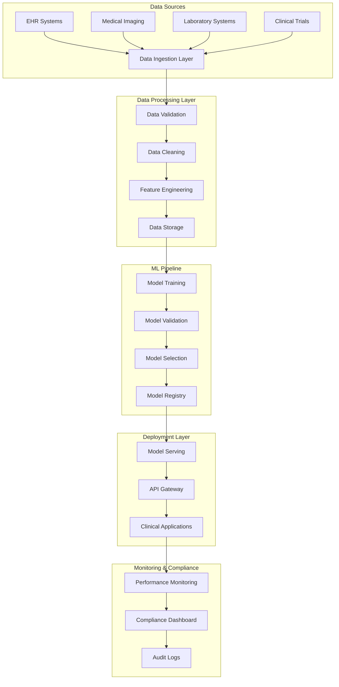

### Component Responsibilities

| Component | Responsibility | Technology Stack |
|-----------|----------------|------------------|
| Data Ingestion | Real-time data collection | Apache Kafka, Apache NiFi |
| Data Processing | ETL operations, validation | Apache Spark, Pandas |
| ML Pipeline | Model training, validation | MLflow, Kubeflow |
| Model Serving | Inference API | TensorFlow Serving, FastAPI |
| Monitoring | Performance tracking | Prometheus, Grafana |

---

## Data Pipeline Architecture

### Data Flow Architecture

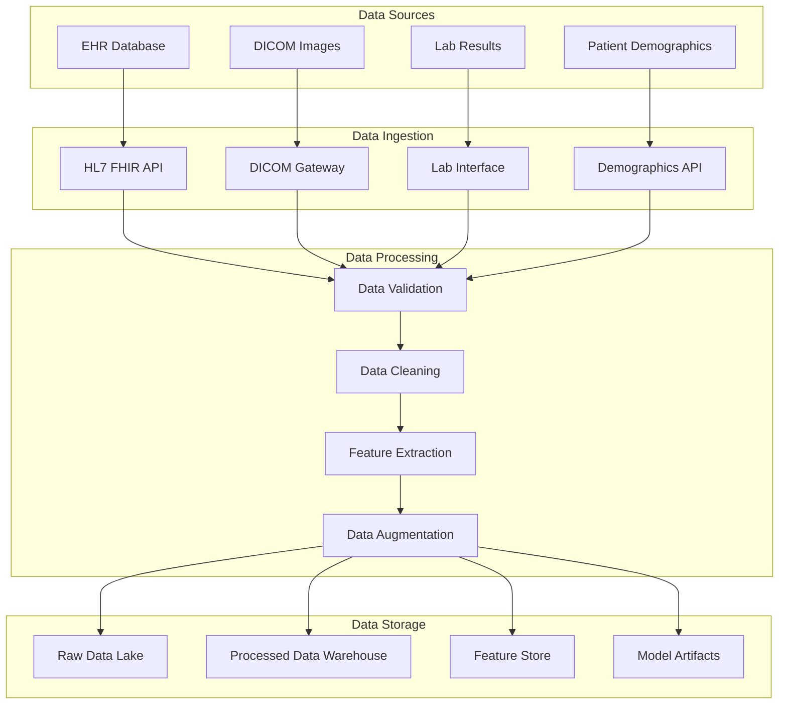

### Data Processing Pipeline

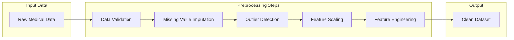

---

## Model Development Pipeline

### ML Development Workflow

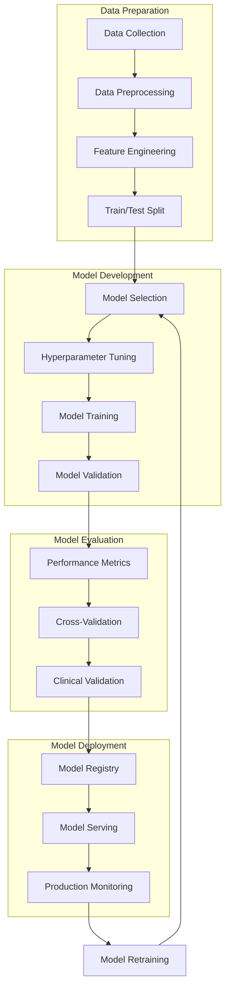

### Model Architecture Comparison

| Model Type | Use Case | Advantages | Disadvantages |
|------------|----------|------------|---------------|
| Logistic Regression | Binary Classification | Interpretable, Fast | Limited complexity |
| Random Forest | Mixed Data Types | Robust, Feature Importance | Less interpretable |
| XGBoost | High Performance | Excellent accuracy | Complex tuning |
| CNN | Medical Imaging | Image pattern recognition | Requires large datasets |
| Transformer | Complex Patterns | State-of-the-art performance | Computational intensive |

---

## Deployment Architecture

### Production Deployment Architecture

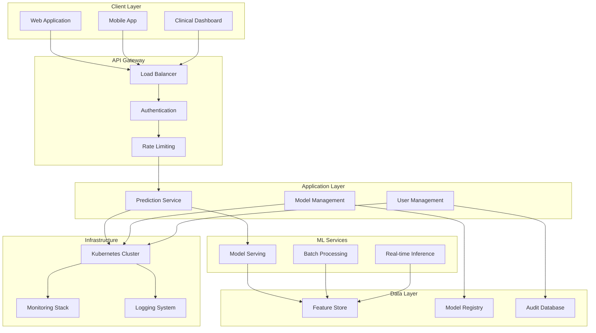

### Microservices Architecture

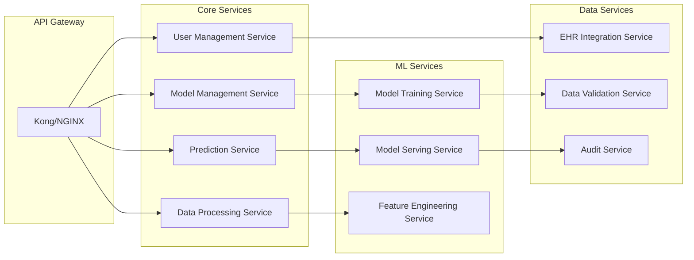

---

## Implementation Phases

### Phase 1: Foundation Setup (Weeks 1-4)

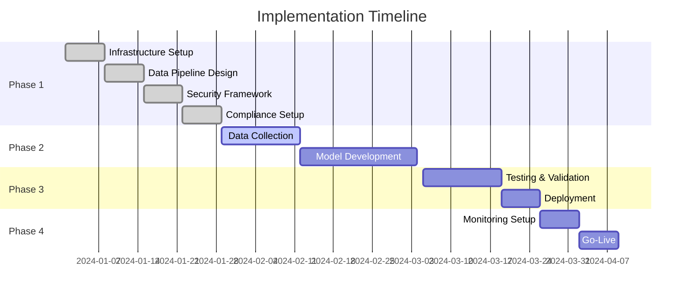

### Phase 2: Data Pipeline Implementation (Weeks 5-8)

**Objectives:**
- Implement data ingestion from multiple sources
- Establish data validation and cleaning processes
- Create feature engineering pipelines
- Set up data storage and retrieval systems

**Deliverables:**
- Data ingestion APIs
- Data validation framework
- Feature engineering pipeline
- Data quality monitoring dashboard

### Phase 3: Model Development (Weeks 9-12)

**Objectives:**
- Develop and train ML models
- Implement model validation framework
- Create model selection criteria
- Establish model registry

**Deliverables:**
- Trained ML models
- Model validation reports
- Model selection framework
- Model registry system

### Phase 4: Deployment and Monitoring (Weeks 13-16)

**Objectives:**
- Deploy models to production
- Implement monitoring systems
- Establish maintenance procedures
- Conduct user training

**Deliverables:**
- Production deployment
- Monitoring dashboard
- Maintenance procedures
- User documentation

---

## Technical Specifications

### System Requirements

#### Hardware Requirements

| Component | Minimum | Recommended | Production |
|-----------|---------|-------------|------------|
| CPU | 8 cores | 16 cores | 32 cores |
| RAM | 32 GB | 64 GB | 128 GB |
| Storage | 1 TB SSD | 2 TB SSD | 5 TB SSD |
| GPU | Optional | NVIDIA RTX 3080 | NVIDIA A100 |

#### Software Stack

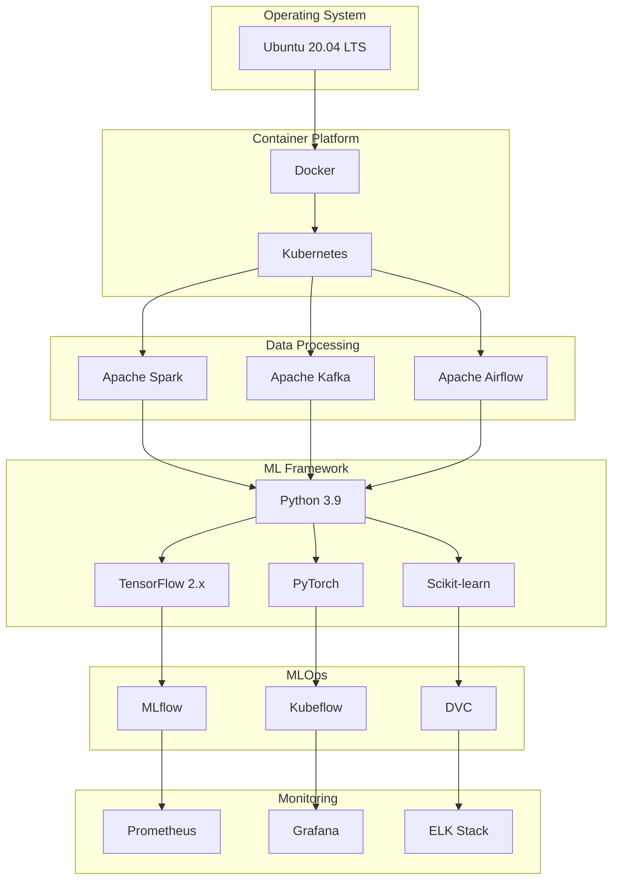

### API Specifications

#### Prediction API Endpoints

```yaml
# Heart Disease Prediction API
/api/v1/heart-disease/predict:
  post:
    summary: Predict heart disease risk
    parameters:
      - name: patient_data
        in: body
        required: true
        schema:
          type: object
          properties:
            age:
              type: integer
              example: 65
            sex:
              type: integer
              example: 1
            cp:
              type: integer
              example: 3
            trestbps:
              type: integer
              example: 145
            chol:
              type: integer
              example: 233
            fbs:
              type: integer
              example: 1
            restecg:
              type: integer
              example: 0
            thalach:
              type: integer
              example: 150
            exang:
              type: integer
              example: 0
            oldpeak:
              type: number
              example: 2.3
            slope:
              type: integer
              example: 0
            ca:
              type: integer
              example: 0
            thal:
              type: integer
              example: 1
    responses:
      200:
        description: Successful prediction
        schema:
          type: object
          properties:
            prediction:
              type: integer
              example: 1
            probability:
              type: number
              example: 0.85
            risk_level:
              type: string
              example: "High"
            confidence:
              type: number
              example: 0.92
```

### Database Schema

#### Patient Data Schema

```sql
-- Patients table
CREATE TABLE patients (
    patient_id UUID PRIMARY KEY,
    first_name VARCHAR(100) NOT NULL,
    last_name VARCHAR(100) NOT NULL,
    date_of_birth DATE NOT NULL,
    gender VARCHAR(10) NOT NULL,
    ethnicity VARCHAR(50),
    created_at TIMESTAMP DEFAULT CURRENT_TIMESTAMP,
    updated_at TIMESTAMP DEFAULT CURRENT_TIMESTAMP
);

-- Clinical measurements table
CREATE TABLE clinical_measurements (
    measurement_id UUID PRIMARY KEY,
    patient_id UUID REFERENCES patients(patient_id),
    measurement_type VARCHAR(50) NOT NULL,
    value DECIMAL(10,2) NOT NULL,
    unit VARCHAR(20) NOT NULL,
    measurement_date TIMESTAMP NOT NULL,
    created_at TIMESTAMP DEFAULT CURRENT_TIMESTAMP
);

-- Predictions table
CREATE TABLE predictions (
    prediction_id UUID PRIMARY KEY,
    patient_id UUID REFERENCES patients(patient_id),
    model_name VARCHAR(100) NOT NULL,
    model_version VARCHAR(20) NOT NULL,
    prediction_value INTEGER NOT NULL,
    probability DECIMAL(5,4) NOT NULL,
    risk_level VARCHAR(20) NOT NULL,
    confidence DECIMAL(5,4) NOT NULL,
    created_at TIMESTAMP DEFAULT CURRENT_TIMESTAMP
);
```

---

## Security and Compliance

### Security Architecture

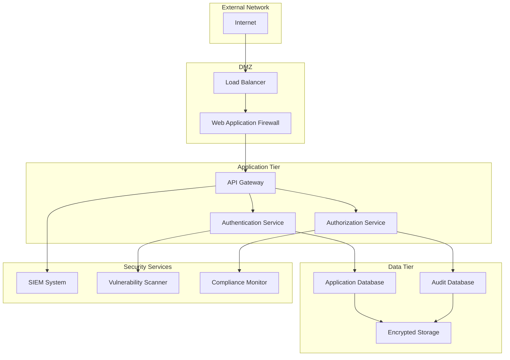

### Compliance Framework

#### HIPAA Compliance Checklist

- [ ] **Administrative Safeguards**
  - [ ] Security Officer Designation
  - [ ] Workforce Training Program
  - [ ] Access Management Procedures
  - [ ] Information Access Management

- [ ] **Physical Safeguards**
  - [ ] Facility Access Controls
  - [ ] Workstation Use Restrictions
  - [ ] Device and Media Controls

- [ ] **Technical Safeguards**
  - [ ] Access Control (Unique User Identification)
  - [ ] Audit Controls
  - [ ] Integrity Controls
  - [ ] Transmission Security

#### Data Privacy Measures

```mermaid
graph LR
    subgraph "Data Collection"
        A[Raw Data]
    end
    
    subgraph "Data Processing"
        B[Data Anonymization]
        C[Pseudonymization]
        D[Encryption]
    end
    
    subgraph "Data Storage"
        E[Encrypted Database]
        F[Access Controls]
        G[Audit Logging]
    end
    
    subgraph "Data Access"
        H[Role-Based Access]
        I[Multi-Factor Authentication]
        J[Session Management]
    end
    
    A --> B
    B --> C
    C --> D
    D --> E
    E --> F
    F --> G
    G --> H
    H --> I
    I --> J
```

---

## Monitoring and Maintenance

### Monitoring Architecture

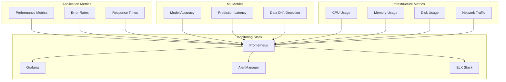

### Alerting Rules

```yaml
# Model Performance Alerts
groups:
  - name: ml_model_alerts
    rules:
      - alert: ModelAccuracyDrop
        expr: model_accuracy < 0.85
        for: 5m
        labels:
          severity: warning
        annotations:
          summary: "Model accuracy below threshold"
          description: "Model {{ $labels.model_name }} accuracy is {{ $value }}"
      
      - alert: PredictionLatencyHigh
        expr: prediction_latency > 1000
        for: 2m
        labels:
          severity: critical
        annotations:
          summary: "High prediction latency"
          description: "Prediction latency is {{ $value }}ms"

# Infrastructure Alerts
  - name: infrastructure_alerts
    rules:
      - alert: HighCPUUsage
        expr: cpu_usage > 80
        for: 5m
        labels:
          severity: warning
        annotations:
          summary: "High CPU usage"
          description: "CPU usage is {{ $value }}%"
```

### Maintenance Procedures

#### Model Retraining Schedule

| Model Type | Retraining Frequency | Trigger Conditions |
|------------|---------------------|-------------------|
| Heart Disease | Monthly | Accuracy < 85%, Data drift detected |
| Cancer Detection | Quarterly | New imaging protocols, Accuracy < 90% |
| Diabetes Prediction | Bi-weekly | New lab standards, Accuracy < 88% |

#### Data Quality Monitoring

```python
# Data quality monitoring example
import pandas as pd
from great_expectations import DataContext

def monitor_data_quality(data_path):
    """Monitor data quality metrics"""
    context = DataContext()
    
    # Load data
    df = pd.read_csv(data_path)
    
    # Define expectations
    expectations = [
        "expect_column_values_to_not_be_null",
        "expect_column_values_to_be_between",
        "expect_column_values_to_be_unique"
    ]
    
    # Run validation
    results = context.validate_dataframe(df, expectations)
    
    return results
```

---

## Appendices

### Appendix A: Model Performance Benchmarks

| Model | Dataset | Accuracy | Precision | Recall | F1-Score | AUC-ROC |
|-------|---------|----------|-----------|--------|----------|---------|
| Heart Disease - Random Forest | UCI Heart Disease | 0.89 | 0.87 | 0.91 | 0.89 | 0.92 |
| Cancer Detection - CNN | Chest X-ray | 0.94 | 0.92 | 0.96 | 0.94 | 0.95 |
| Diabetes - XGBoost | Pima Indians | 0.87 | 0.85 | 0.89 | 0.87 | 0.90 |

### Appendix B: Cost Estimation

#### Infrastructure Costs (Monthly)

| Component | Cost (USD) | Notes |
|-----------|------------|-------|
| Compute Instances | $2,000 | 4x c5.2xlarge instances |
| Storage | $500 | 5TB SSD storage |
| Database | $800 | RDS PostgreSQL |
| Monitoring | $300 | CloudWatch, Prometheus |
| Security | $400 | WAF, Security services |
| **Total** | **$4,000** | Monthly operational cost |

### Appendix C: Risk Assessment

| Risk Category | Risk Level | Mitigation Strategy |
|---------------|------------|-------------------|
| Data Breach | High | Encryption, access controls, audit logging |
| Model Bias | Medium | Bias testing, diverse training data |
| Performance Degradation | Medium | Continuous monitoring, automated retraining |
| Regulatory Non-compliance | High | Regular compliance audits, legal review |
| System Downtime | Medium | High availability design, backup systems |

### Appendix D: Contact Information

| Role | Name | Email | Phone |
|------|------|-------|-------|
| Project Manager | [Name] | [email] | [phone] |
| ML Engineer | [Name] | [email] | [phone] |
| Data Engineer | [Name] | [email] | [phone] |
| Security Officer | [Name] | [email] | [phone] |
| Compliance Officer | [Name] | [email] | [phone] |

---

## Document Information

- **Version**: 1.0
- **Last Updated**: [Current Date]
- **Author**: ML Engineering Team
- **Reviewers**: Security Team, Compliance Team, Clinical Team
- **Next Review**: [Date + 3 months]

---

*This document is confidential and proprietary. Distribution is restricted to authorized personnel only.*
